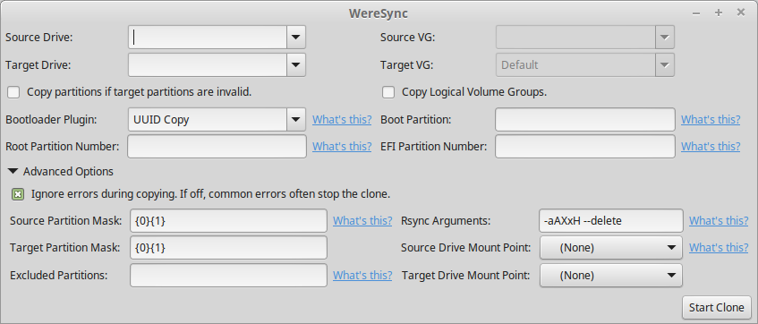

.. gui information

########################
Graphical User Interface
########################

Provides a simple user interface in order to produce clones. Each field provided by
the GUI has a "What's This?" link which opens a dialog explaining the field.

By default WereSync outputs all log files to ``/var/log/weresync``. If any errors or problems occur, please be sure to include the output of the most recent file in your report.

To start the gui run the command::

    $ sudo weresync-gui

.. IMPORTANT::
   WereSync requires root permissions to run, because it has to access block devices. Standard linux permissions restrict access to block devices to ordinary users.

Bootloader Installation
=======================

WereSync will try to install the `Grub2 <https://www.gnu.org/software/grub/manual/grub.html>`_ bootloader on the target drive after the files have been copied. Other bootloaders are currently not supported.

If you have your /boot directory on another partition, be sure to pass that partition number to the "Boot Partition" field under advanced options.

Dependencies
============

The WereSync GUI runs using GTK and requires the `PyGObject <http://www.pygtk.org/>`_ bindings to be installed. On Ubuntu these can be installed with::

    $ sudo apt-get install python3-gi

API Reference
=============

The GUI can be started from the ``gui`` module with the method ``start_gui()``::

    >>> import weresync.gui
    >>> weresync.gui.start_gui()

